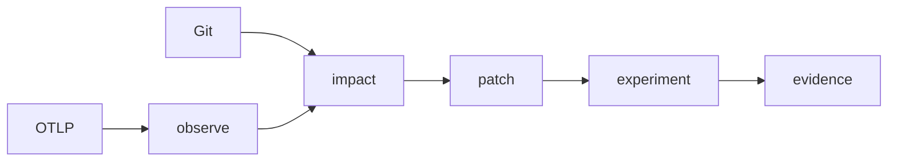
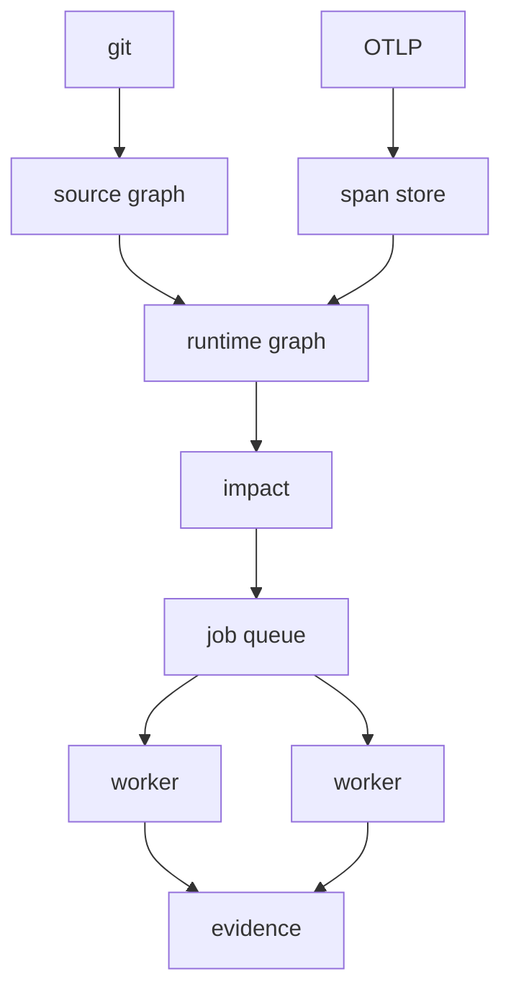

# Aquila

**Control plane for changing distributed backends safely.**

[](https://github.com/sumedh-aerram/Aquila/actions/workflows/ci.yml)

A payment hunk is not “the payment service.” Aquila joins **git** (what the code is) to **OpenTelemetry** (how it ran), names the blast radius, and only then hits the **same routes** on baseline and patch.

Match is not a pass. A skipped experiment is not evidence. There is no LLM in this loop.


| Bucket | Meaning | Provenance |
| --- | --- | --- |
| **direct** | hunk overlaps this function | `changed_lines` |
| **likely** | typed callers, not callees | `caller` / `types` |
| **runtime** | hops that actually ran | `observed_parent` / `code_attrs` |
| **unobserved** | changed code, no locate hit | left empty — not guessed |

## Quick start

Needs Go 1.25+, Docker, and Compose. Ports bind to loopback. First `make dev` builds images.

```bash
git clone https://github.com/sumedh-aerram/Aquila.git
cd Aquila
make dev && make cli && make shop-smoke

./bin/aquila impact -f internal/pair/testdata/d1.diff -traces 20 -service gateway
```

That is the picture above: `chargeProcessor` from the diff, `authorize` as its typed caller, checkout → payment → processor from traces. `chargeProcessor` itself stays **unobserved** until a span binds it.

> [!NOTE]
> If `observe` lists more than one `service.name`, keep `-service gateway` so the shop window is not mixed with other attaches.

```bash
./bin/aquila observe -traces 20 -service gateway
./bin/aquila ask checkout
```


Leave the stack up. `make cli` rebuilds the binary in seconds. `make up` restarts Compose without rebuilding images. `make down` when you are done.

## Loop



| Step | Command | You get |
| --- | --- | --- |
| Observe | `aquila observe` | Hops vs binds, labeled |
| Ask | `aquila ask checkout` | Those facts, or nothing |
| Impact | `aquila impact` | Blast radius of `git diff HEAD` (or `-f` / stdin) |
| Patch | `aquila patch` | First matching shop rewrite (D1–D6). Not a pass |
| Experiment | `aquila experiment` | Same workload on baseline and patch → match / differ / incomplete |
| Report | `aquila report` | Markdown from saved evidence JSON |

`aquila run` is ask → plan → candidate → experiment in one shot. `-plan-only` stops before gateways.

```bash
git diff -- examples/shop/internal/payment/handler.go | ./bin/aquila impact -traces 20 -service gateway
./bin/aquila patch -f internal/pair/testdata/d1.diff
git diff | ./bin/aquila experiment -fixture -n 1 -out out/evidence.json
./bin/aquila report out/evidence.json
```

`-n 1` / `-smoke` cannot earn `validated=true`. That bit is earned only when required steps succeed on a **clean recorded SHA** with latency n≥20.

## Demo shop

`examples/shop/` is seven instrumented services with documented defects ([DEFECTS.md](examples/shop/DEFECTS.md)). Demo target, not a second product. The hop diagram above is what `shop-smoke` actually ran.

| ID | Symptom |
| --- | --- |
| D1 | New HTTP client on every authorize |
| D2 | N+1 address queries |
| D3 | Unindexed `inventory_events.sku` |
| D4 | Checkout retries payment 5×, no backoff |
| D5 | Synchronous notify on the checkout path |
| D6 | Process-wide Redis lock |

Gateway: [http://127.0.0.1:18080](http://127.0.0.1:18080) — internals stay on the Compose network.

## Commands

| Command | What it does |
| --- | --- |
| `status` / `version` | Health, ready, build |
| `observe` / `ask` | Runtime hops, source, span-to-source binds |
| `impact` | Blast radius of local git changes |
| `patch` | Shop rewrite candidate (`-apply` writes the tree) |
| `plan` / `experiment` / `run` | DAG; execute; ask+plan+patch+experiment |
| `env` / `replay` / `fault` | Isolated pair; same workload on two gateways; loopback 502/delay |
| `report` / `runs` | Evidence file → markdown; list/show stored runs |
| `job` / `jobs` / `worker` | Durable DAG, cancel, lease/commit over gRPC |

```bash
make build && make test && make lint
```

| Service | URL |
| --- | --- |
| Aquila | http://127.0.0.1:8080/healthz |
| Shop | http://127.0.0.1:18080/healthz |
| Grafana | http://127.0.0.1:13000 (`admin` / `aquila`) |
| Prometheus | http://127.0.0.1:9090 |
| OTLP | `:4317` gRPC, `:4318` HTTP |

<details>
<summary>Your own checkout</summary>

After `make dev` from this repository:

```bash
export AQUILA_API_URL=http://127.0.0.1:8080
cd /path/to/your/app
# export OTLP to 127.0.0.1:4317 (not otel-collector:4317 — that is Docker DNS)
aquila observe -service ledger
# edit, save, then:
aquila impact -service ledger
aquila experiment -service ledger -base http://127.0.0.1:BASE -patch http://127.0.0.1:PATCH -out /tmp/evidence.json
```

Typed callers need a Go module in `-dir`. Python (and friends) still show hops from OTLP; locate and likely callers stay unmapped until spans set `code.function.name` + `code.file.path`. Do not bind the app under test to `:8080` (Aquila).

Omitting `-base` / `-patch` starts shop Compose **only** when `-dir` is `examples/shop` or this repo. A foreign checkout must pass two gateway URLs. `-fixture` is shop checkout smoke and is rejected off the shop. POST needs a `-workload` you wrote.

</details>

<details>
<summary>How it is put together</summary>



Git is source truth. OpenTelemetry is runtime truth. PostgreSQL is Aquila’s coordination state. An LLM may propose; it never authors system state.

Workers lease READY tasks over loopback gRPC, heartbeat a 15s lease, and cannot commit a stale attempt. `validated` is earned after required executable steps succeed with overall match on a clean recorded revision.

When `AQUILA_API_TOKEN` is set, the CLI sends `Authorization: Bearer`. Local Compose leaves it empty. GCP module: [`deploy/terraform/`](deploy/terraform/README.md) (not applied from this repo). Ingest privacy and sandbox bounds: [docs/SECURITY.md](docs/SECURITY.md).

</details>

<details>
<summary>Operator notes</summary>

- `observe -dir` loads that Go module. Standing in this repository falls back to `GET /v1/source` so the shop snapshot still maps. No `go.mod` → `origin=none`.
- Impact reads `git diff HEAD` in `-dir` when stdin is empty. It does not apply the patch or keep hunk bodies.
- Span-derived replay is GET/HEAD/OPTIONS from server routes. Parameterized `{…}` templates and mutating methods are skipped. Bodies never come from traces.
- A window with more than one `service.name` needs `-service`. Health-probe traces are omitted from the window.
- `env` copies the shop twice and applies the diff only to patch (ports 18180/18280). It does not start containers or touch the live shop on 18080.
- Experiment traces stay in the pair’s debug collector, not the live store. `-out` omits request bodies. A missing runs store prints `unrecorded`, not a pass.
- Jobs refuse overlapping unfinished DAGs on the same gateway host (`409`). `aquila jobs cancel <id>` frees it. Unfinished jobs fail after 10m.
- `worker -once` leases one task. `worker -job` pins the lease. HTTP replay to operator gateways still runs on the host.
- `aquila-exec` (`make executor`) is a C++20 supervisor; `--net none` is Linux-only and fails closed on macOS.

</details>

## License

Source in this repository is for the Aquila project. Licensing will be declared before a public release.
