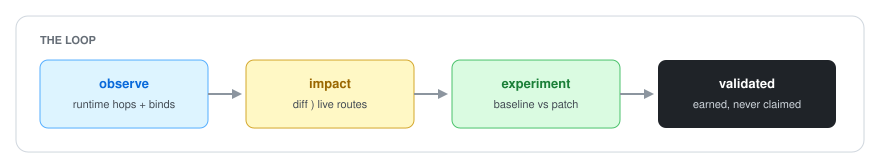
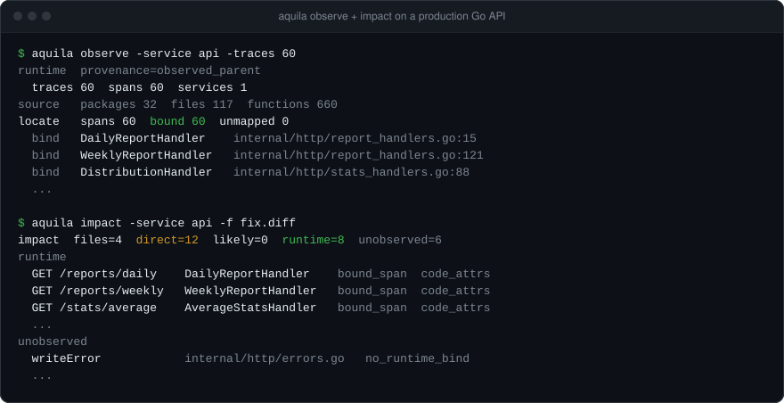
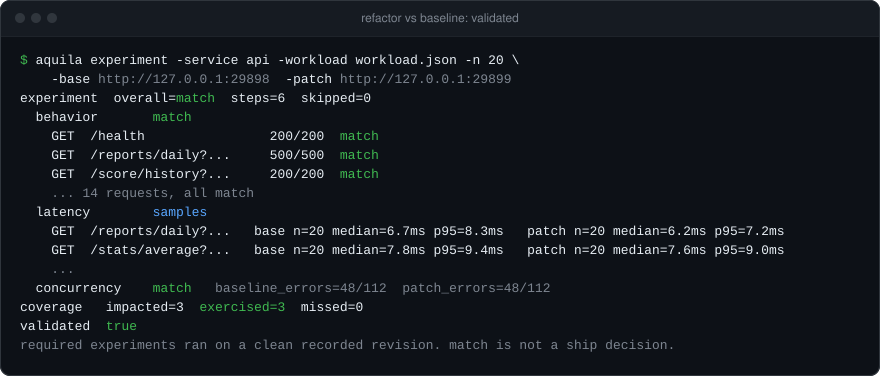
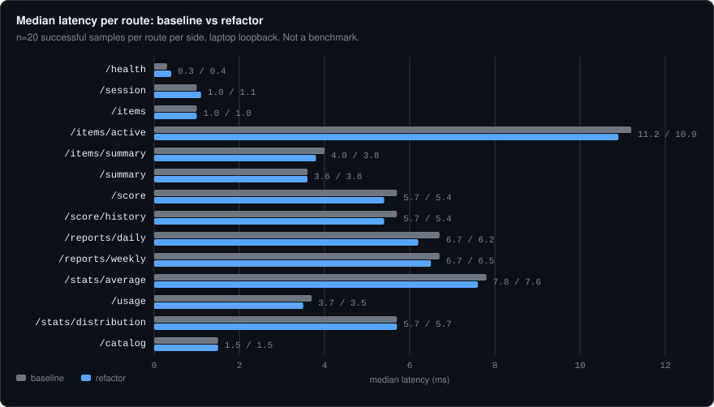
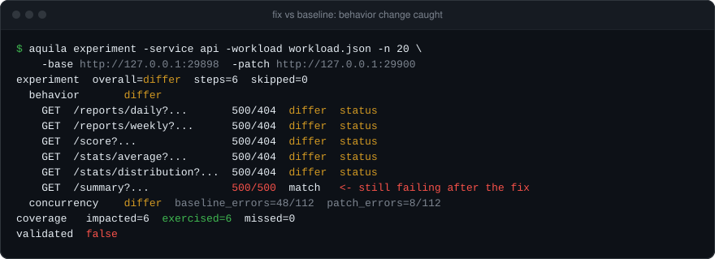
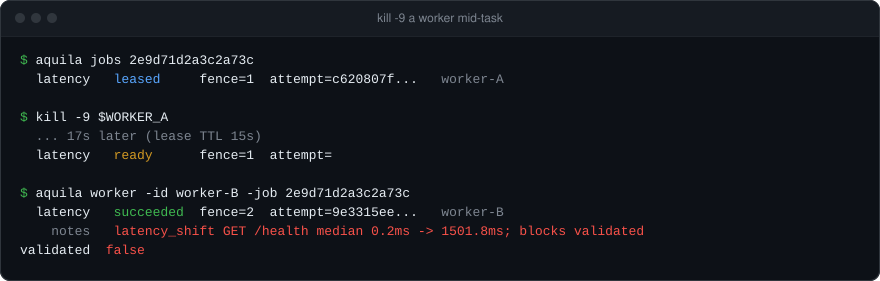

# Aquila

**See what your backend change breaks before you push it.**

[](https://github.com/sumedh-aerram/Aquila/actions/workflows/ci.yml)

You change a handler. Tests pass. Review looks fine. A week later a route nobody thought about starts returning 500s.

Aquila catches that on your laptop, before the PR. It reads your uncommitted `git diff` and the OpenTelemetry traces your services already send, finds every live route that runs the code you changed, and replays real requests against your old build and your new build side by side. It only says `validated` when those requests reached your change and nothing got worse.

No production access. No LLM. Everything runs on localhost.



## We ran it on a real production backend

We pointed Aquila at a private production Go API: 32 packages, 117 files, 660 functions, not written for Aquila. We ran two real commits through it, a refactor that should change nothing and a bug fix that should change status codes. Route and function names are renamed. Every number below came out of the Aquila terminal.

| What Aquila measured | Result |
| --- | --- |
| Runtime spans tied to a function and line | **60 of 60** |
| Functions the fix changed | **12**, of which **8** run on live routes |
| Refactor vs the old build | **14 of 14** requests identical, **validated** |
| Latency per route | **n=20**, medians within **0.5 ms** |
| Fix vs the old build | **5** routes went **500 to 404** as intended |
| Bug the fix missed | **1** route still returning **500** |
| Dead worker, killed mid-task | recovered in **17 s** |

### 1. It showed exactly what the diff touches



Every request in the traces was tied to the function that handled it. The fix touched 12 functions. Aquila showed the 8 that real traffic actually reaches, and listed the other 6 separately as `unobserved` instead of pretending they were covered.

**How it helped:** instead of guessing which endpoints to retest, the list of routes to check came straight from production-shaped traffic.

### 2. It proved the refactor was safe



Both builds ran side by side. All 14 requests returned the same status, error rates under concurrency were identical (48 of 112 on both sides), and the requests reached all 3 routes that run the refactored code. That earned `validated true`.



**How it helped:** the refactor shipped with evidence, not a hunch. Twenty samples per route, on every route, showed no slowdown.

### 3. It caught a bug inside the fix



The fix was meant to turn "no data" errors from 500 into 404. Five routes changed exactly as intended. But `/summary`, which the diff also touched, still returned 500: its error message didn't match the string the fix was checking for. Aquila reports `differ`, not `validated`, because a behavior change is yours to approve.

**How it helped:** the missed route showed up in one table, before the fix was merged.

### 4. It refused to fake a pass

Aquila only says `validated` when it has the evidence. Every one of these came back `false`, with the reason printed:

| What went wrong | What Aquila said |
| --- | --- |
| The new build wasn't running | `incomplete`, no requests answered |
| The test traffic skipped the changed routes | `missed 7/7`, cannot validate |
| Requests had no credentials, so every route returned 401 | `auth_rejected: handler did not run` |
| The new build was 1.5 s slower | `latency_shift 0.2ms -> 1501.8ms` |

It also keeps working when infrastructure fails. Here a worker was killed in the middle of a task:



The task went back to the queue when the worker's 15 second lease expired, and a second worker finished it. The dead worker's attempt can never overwrite the result (fence 1 vs fence 2).

## Try it in 3 minutes

Needs Go 1.25+ and Docker. This starts Aquila and a bundled seven-service demo shop on localhost.

```bash
git clone https://github.com/sumedh-aerram/Aquila.git && cd Aquila
make dev && make cli && make shop-smoke

./bin/aquila observe -service gateway -traces 20
./bin/aquila impact  -service gateway -traces 20 -f internal/pair/testdata/d1.diff
make experiment-smoke              # old and new shop side by side, writes out/evidence.json
./bin/aquila report out/evidence.json
```

The smoke run takes one sample per route, so it prints `validated false` on purpose. Use `-n 20` for a real verdict. Run `make down` when you're done.

## Use it on your own service

Your service needs to send OpenTelemetry traces to `127.0.0.1:4317` and set `code.function.name` and `code.file.path` on spans. That is how Aquila ties a request to a function.

```bash
cd ~/src/your-go-service

aquila observe -service your-api        # what runs, and in which function
# edit your code, don't commit
aquila impact  -service your-api        # what your diff touches

# run the old build on :9001 and your edited build on :9002
aquila experiment -service your-api \
  -base http://127.0.0.1:9001 -patch http://127.0.0.1:9002 \
  -health /health -workload workload.json -n 20 -out evidence.json
aquila report evidence.json
```

`workload.json` lists the requests to replay. Tokens come from environment variables, so they never sit in a file or in the evidence:

```json
{"steps": [
  {"method": "GET", "path": "/health"},
  {"method": "GET", "path": "/user/me", "headers": {"Authorization": "Bearer ${MY_TOKEN}"}}
]}
```

Leave out `-workload` and Aquila replays the GET routes it saw in your traces.

## When does it say validated?

`match` only means both builds answered the same way. `validated true` needs all five:

1. Every required check ran and succeeded: health, behavior, latency, and concurrency and tests when planned.
2. The new build is a clean, committed git revision. You can analyze a dirty tree, but not validate it.
3. At least 20 latency samples per route.
4. At least one request reached a route that runs your changed code, and both builds actually handled it. A 401 on both sides doesn't count.
5. No route got more than 2x and 5 ms slower.

The server checks these again for every stored run and rejects evidence that claims more than it earned.

## How it compares

| | Before you push | Uses real request paths | Old vs new, side by side | Refuses a false pass |
| --- | --- | --- | --- | --- |
| Unit tests | yes | only the ones you wrote | no | no |
| Code review | yes | no | no | no |
| Tracing dashboards | after deploy | yes | no | no |
| **Aquila** | **yes** | **yes** | **yes** | **yes** |

## Commands

| Every day | |
| --- | --- |
| `observe` | What ran, and which function handled each request |
| `impact` | Functions and live routes your diff touches |
| `experiment` | Old build vs new build: behavior, latency, errors, coverage |
| `report` | Readable Markdown from an evidence file |
| `ask "..."` | Facts from traces and code that match a question |

| For teams | |
| --- | --- |
| `runs` | History of every experiment, stored in Postgres |
| `job`, `jobs`, `worker` | Queue experiments and run them on workers, with crash recovery |
| `plan`, `run` | Preview the experiment plan, or investigate, plan, and run in one step |
| `status`, `attaches` | Is Aquila up, and which services are sending traces |

<details>
<summary>What's done and what isn't</summary>

**Done and tested:** observe, impact, plan, experiment, and report on an outside Go codebase. Coverage and latency checks on `validated`. Queued jobs across several workers with leases, heartbeats, and protection against stale workers. Live crash recovery. Per-service limits so one app can't hog the workers. Result caching, a container sandbox, and a native process supervisor. Prometheus and Grafana for Aquila itself.

**Not built yet:** AI agents, automatic patches for any app (`patch` only knows the demo shop), function mapping for Python, GitHub PR integration, a web dashboard, a live cloud deployment.

</details>

<details>
<summary>Operator notes</summary>

- If traces contain more than one service, pass `-service` so another app can't crowd out yours.
- Don't run the app you're testing on `:8080`; that's Aquila's API.
- Send traces to `127.0.0.1:4317` from your machine. `otel-collector:4317` only works inside Docker.
- Queued jobs refuse workloads with headers, so credentials never end up in the database. Run authenticated experiments with `aquila experiment` locally.
- Set `AQUILA_API_TOKEN` to require a token on the API and the worker port. Local Compose leaves it empty and only listens on `127.0.0.1`.
- `AQUILA_LEASED_TASKS_PER_SERVICE` limits how many tasks one service can run at once.
- Aquila never stores request or response bodies. See [docs/SECURITY.md](docs/SECURITY.md).

| Service | URL |
| --- | --- |
| Aquila API | http://127.0.0.1:8080/healthz |
| Demo shop | http://127.0.0.1:18080/healthz |
| Grafana | http://127.0.0.1:13000 (`admin` / `aquila`, local only) |
| Traces (OTLP) | `:4317` gRPC, `:4318` HTTP |

</details>

## Develop

```bash
make build && make test && make lint
```

## License

Source in this repository is for the Aquila project. Licensing will be declared before a public release.
