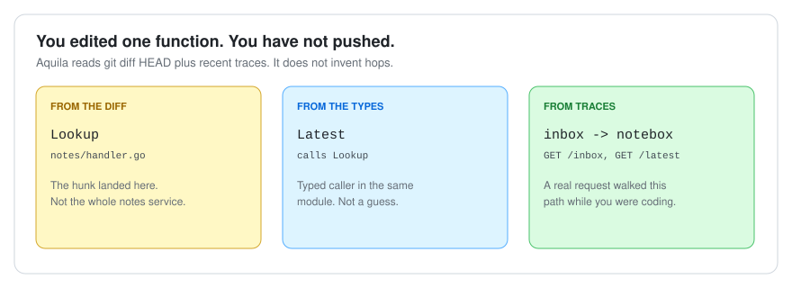
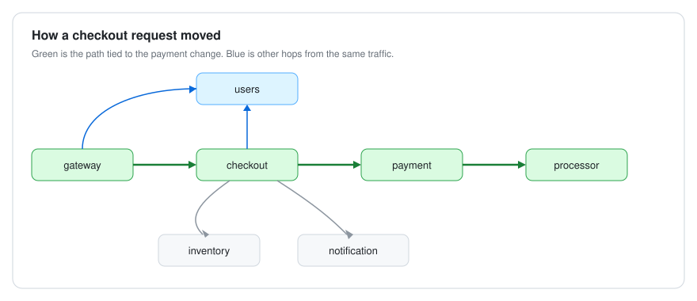
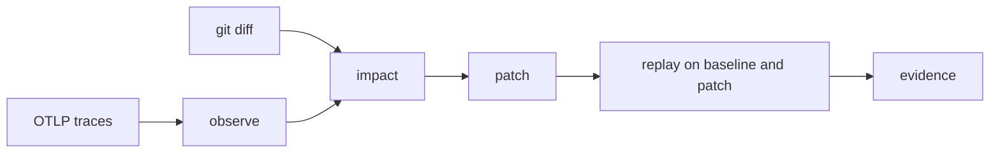

# Aquila

See what a backend change actually hits — in the code and in production traces — before you call it safe.

[](https://github.com/sumedh-aerram/Aquila/actions/workflows/ci.yml)

You edit a function. Aquila reads the **diff**, the **Go types**, and recent **OpenTelemetry traces**, and prints a blast radius. Then it can hit the **same routes** on a copy of the app from before and after the change.

It will not guess a hop it did not observe. It will not treat a skipped experiment as evidence. There is no LLM in this loop.

## One function, four facts

This is a real payment-handler change in the demo shop. Aquila does not say “the payment service.” It says exactly this:



| In the picture | In the CLI | Meaning |
| --- | --- | --- |
| From the diff | `direct` | The hunk landed in this function |
| From the types | `likely` | Something in source calls that function |
| From traces | `runtime` | A request path that actually ran |
| Not guessed / left blank | `unobserved` | Changed code with no matching span — on purpose |

## Run it

Needs Go 1.25+, Docker, and Compose. First `make dev` builds images. Ports stay on loopback.

```bash
git clone https://github.com/sumedh-aerram/Aquila.git
cd Aquila
make dev && make cli && make shop-smoke

./bin/aquila impact -f internal/pair/testdata/d1.diff -traces 20 -service gateway
```

You should see `chargeProcessor`, `authorize`, and the checkout → payment → processor path. `chargeProcessor` itself stays `unobserved` until a span binds it.

```bash
./bin/aquila observe -traces 20 -service gateway
```



> [!NOTE]
> If `observe` lists more than one `service.name`, keep `-service gateway`. That keeps the demo on the shop instead of mixing in other apps.

`make cli` rebuilds the binary. `make up` restarts Compose without rebuilding images. `make down` when you are done.

## The rest of the loop



| You want | Run |
| --- | --- |
| Facts for a question | `./bin/aquila ask checkout` |
| A shop rewrite for this diff | `./bin/aquila patch -f internal/pair/testdata/d1.diff` |
| Same workload on before and after | `git diff \| ./bin/aquila experiment -fixture -n 1 -out out/evidence.json` |
| Readable evidence | `./bin/aquila report out/evidence.json` |

`aquila run` is ask → plan → candidate → experiment in one shot.

`-n 1` cannot mark the change `validated`. That only happens when the required steps succeed on a **clean recorded SHA** with enough latency samples (n≥20). Match still means “the two sides looked the same,” not “ship it.”

## Demo shop

`examples/shop/` is seven small services with documented defects ([DEFECTS.md](examples/shop/DEFECTS.md)). It exists so the commands above have something real to look at.

| | What is wrong |
| --- | --- |
| D1 | New HTTP client on every authorize |
| D2 | N+1 address queries |
| D3 | Unindexed `inventory_events.sku` |
| D4 | Checkout retries payment 5×, no backoff |
| D5 | Synchronous notify on the checkout path |
| D6 | Process-wide Redis lock |

Shop gateway: [http://127.0.0.1:18080](http://127.0.0.1:18080)

## Commands

| Command | What it does |
| --- | --- |
| `status` / `version` | Is the control plane up |
| `observe` / `ask` | What ran, and facts for a question |
| `impact` | Blast radius of local git changes |
| `patch` | Shop rewrite candidate (`-apply` writes the tree) |
| `plan` / `experiment` / `run` | Plan, execute, or do the local loop |
| `env` / `replay` / `fault` | Isolated pair, same workload on two gateways, loopback 502 |
| `report` / `runs` | Evidence file → markdown; stored runs |
| `job` / `jobs` / `worker` | Durable DAG over gRPC |

```bash
make build && make test && make lint
```

| Service | URL |
| --- | --- |
| Aquila | http://127.0.0.1:8080/healthz |
| Shop | http://127.0.0.1:18080/healthz |
| Grafana | http://127.0.0.1:13000 (`admin` / `aquila`) |
| Prometheus | http://127.0.0.1:9090 |
| OTLP | `:4317` gRPC, `:4318` HTTP |

<details>
<summary>Point it at your own checkout</summary>

After `make dev` from this repository:

```bash
export AQUILA_API_URL=http://127.0.0.1:8080
cd /path/to/your/app
# export OTLP to 127.0.0.1:4317 (not otel-collector:4317 — that is Docker DNS)
aquila observe -service ledger
# edit, save, then:
aquila impact -service ledger
aquila experiment -service ledger -base http://127.0.0.1:BASE -patch http://127.0.0.1:PATCH -out /tmp/evidence.json
```

Typed callers need a Go module in `-dir`. Other languages still show hops from OTLP; function mapping stays empty until spans set `code.function.name` and `code.file.path`. Do not bind the app under test to `:8080` (Aquila).

Omitting `-base` / `-patch` starts the shop Compose **only** when `-dir` is `examples/shop` or this repo. A foreign checkout must pass two gateway URLs. `-fixture` is shop checkout smoke and is rejected off the shop. POST needs a `-workload` you wrote.

</details>

<details>
<summary>How it is put together</summary>

Git is source truth. OpenTelemetry is runtime truth. PostgreSQL is Aquila’s coordination state. An LLM may propose; it never authors system state.

Workers lease READY tasks over loopback gRPC, heartbeat a 15s lease, and cannot commit a stale attempt.

When `AQUILA_API_TOKEN` is set, the CLI sends `Authorization: Bearer`. Local Compose leaves it empty. GCP module: [`deploy/terraform/`](deploy/terraform/README.md) (not applied from this repo). Ingest privacy and sandbox bounds: [docs/SECURITY.md](docs/SECURITY.md).

</details>

<details>
<summary>Operator notes</summary>

- `observe -dir` loads that Go module. Standing in this repository falls back to `GET /v1/source` so the shop snapshot still maps. No `go.mod` → `origin=none`.
- Impact reads `git diff HEAD` in `-dir` when stdin is empty. It does not apply the patch or keep hunk bodies.
- Span-derived replay is GET/HEAD/OPTIONS from server routes. Parameterized `{…}` templates and mutating methods are skipped. Bodies never come from traces.
- A window with more than one `service.name` needs `-service`. Health-probe traces are omitted from the window.
- `env` copies the shop twice and applies the diff only to patch (ports 18180/18280). It does not start containers or touch the live shop on 18080.
- Experiment traces stay in the pair’s debug collector, not the live store. `-out` omits request bodies. A missing runs store prints `unrecorded`, not a pass.
- Jobs refuse overlapping unfinished DAGs on the same gateway host (`409`). `aquila jobs cancel <id>` frees it. Unfinished jobs fail after 10m.
- `worker -once` leases one task. `worker -job` pins the lease. HTTP replay to operator gateways still runs on the host.
- `aquila-exec` (`make executor`) is a C++20 supervisor; `--net none` is Linux-only and fails closed on macOS.

</details>

## License

Source in this repository is for the Aquila project. Licensing will be declared before a public release.
